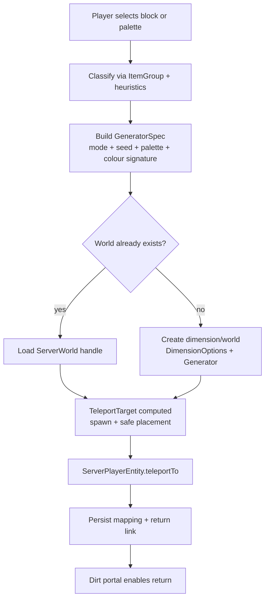

# Block-Driven Worlds in Fabric 1.21.11  
## Executive summary

Minecraft’s block “identity” is fundamentally registry-based: every block and item is keyed by a namespaced identifier, and world saves serialise block *states* (block + property map) using those namespaced identifiers plus a palette/bit-packed index array inside chunk-section NBT. citeturn23search6turn2search9

Creative inventory organisation is not “block-native”; it is driven by **ItemGroups** (creative tabs) whose contents are lists of **ItemStacks**. Fabric exposes hooks to modify these lists via `ItemGroupEvents`, and vanilla tab keys live in `ItemGroups`. citeturn12view0turn4search2turn7search10 In modern versions (incl. 1.21.11), `ItemStack` is explicitly described as holding item **components** (data components), and the vanilla component registry (`DataComponentTypes`) includes `CUSTOM_DATA`, `BLOCK_STATE`, and `BLOCK_ENTITY_DATA`, which collectively cover most “NBT-like” per-stack persistence needs. citeturn29search0turn28view0turn24search9turn0search23

For a Fabric 1.21.11 mod that generates *block-determined worlds* and teleports players into them, the most robust approach is a **server-side world/dimension manager** that can create-or-load dimensions keyed by a stable “generator specification” derived from a selected block or palette. Teleportation should use vanilla’s `Entity#teleportTo` / `ServerPlayerEntity#teleportTo(TeleportTarget)` because Fabric’s older `FabricDimensions` API was removed once vanilla superseded it. citeturn29search20turn29search1 Since runtime dimension management is not a single, small API surface in vanilla, you should plan for a *datapack-first* path (predeclared templates) and/or a *Mixin-assisted* path similar in spirit to existing multiworld/dynamic-dimension mods (e.g., Multiverse stores generated dimensions under `world/dimensions/<namespace>/<path>`). citeturn16view0

World generation can be framed as three generator families:  
- **Single-biome** (fixed biome source + noise/flat generator tuned by the selected block)  
- **Multi-biome** (multi-noise / custom biome source selecting from a biome set computed from blocks/colours)  
- **Novelty / April-Fool** (rule-bending generators: checkerboards, extreme surface rules, palette swaps, per-chunk “theme shifts”)  

Key technical anchors: `ChunkGeneratorSettings`, `NoiseConfig`, biome-source multi-noise hypercubes, and feature placement APIs (`PlacedFeature.generate`). citeturn31search7turn31search1turn31search3turn31search17

## How blocks are represented in registries, creative tabs, and saves

### Registry identity and lookup

At runtime, Minecraft’s registries are mutable in vanilla terms (“all registries are instances of `MutableRegistry`”), and entries are referenced via registry keys and identifiers. citeturn2search9turn2search3turn2search5 In practice for mod code you’ll mainly use:

- **IDs**: `Identifier` (`namespace:path`) as the durable textual identifier.
- **Registry access**: `Registries.BLOCK`, `Registries.ITEM`, plus `RegistryKey<T>` wrappers.
- **Dynamic serialization**: Mojang `Codec`/`MapCodec` patterns, plus helper classes like `RegistryCodecs` / `RegistryOps` when you need a codec that serialises registry references. citeturn2search5turn2search7

This matters for “world-from-block” because your generator specification must be serialisable and stable:
- Use the **block ID** (`Identifier`) plus a **block-state** descriptor (properties) as the core input.
- Treat “block instance” (`Block` reference) as runtime-only; persist IDs.

### Creative inventory storage model

Creative inventory tabs are **ItemGroups**. Fabric’s `ItemGroupEvents.modifyEntriesEvent(RegistryKey<ItemGroup>)` is the canonical hook to add/remove/reorder entries. citeturn12view0 Vanilla tab keys (e.g., building blocks) are exposed on `ItemGroups`, and Fabric explicitly documents that those registry keys are stored there. citeturn4search2turn7search10

Implication for your requirement “classify blocks into building / functional / natural / redstone”:  
The most *vanilla-aligned* classifier is **tab membership**:

- Convert a `Block` → `Item` via `block.asItem()` and require that it is a `BlockItem` if you want to treat it as placeable from inventory.
- Determine which of the four vanilla tabs the item appears in (client-side is easiest because item groups are a UI concept; on dedicated servers you may need to compute classification another way, or ship a classification snapshot from client → server at login).

Because item groups can be modified by mods and datapacks, classification by tabs is naturally “mod-aware”: modded blocks often register their creative placement intentionally.

### Saved-world representation: chunk NBT palettes and block state serialisation

In world saves, blocks are stored per **chunk section** (sub-chunk). Each section contains `block_states`, which contains:

- `palette`: list of distinct block states used in that section, where each entry includes `Name` (resource location) and optional `Properties`.
- `data`: a packed long array of 4096 palette indices (one per block position in a 16×16×16 section), with bit-width determined by palette size (minimum 4 bits; packing rules changed in 1.16). citeturn23search6

This is the key mapping from registry identity → on-disk block representation: **the saved form is always “id + properties”**, never “raw numeric block IDs” in modern versions. citeturn23search6

If you ever need to reason about storage-level costs or palette behaviour (e.g., for “novelty worlds” that deliberately constrain palette entropy), palette concepts are also described in protocol/storage docs: a palette maps numeric IDs to block states, and section palettes exist to compress local diversity. citeturn22view3

### ItemStack data, block state on stacks, and “NBT” in 1.21.11

Modern Minecraft uses **data components** for per-`ItemStack` persistence. Yarn’s `ItemStack` documentation explicitly states that a stack holds the item count and the stack’s **components**. citeturn29search0 Fabric’s developer docs describe “custom data components” as the supported way to store persistent custom data on stacks since 1.20.5. citeturn24search9turn0search23 Mojang release notes for 1.20.5 describe the shift to a “new set of data components.” citeturn0search23

For your mod, `DataComponentTypes` in 1.21.11 is the lookup table for built-in components. The presence of:
- `CUSTOM_DATA` (as an `NbtComponent`)
- `BLOCK_STATE` (as a `BlockStateComponent`)
- `BLOCK_ENTITY_DATA` (typed entity data for block entities)
means you can persist: “selected block”, “selected block state”, “selected palette”, and “return-destination metadata” directly on the triggering item or portal activator without inventing your own file formats. citeturn28view0

## Designing world generation from blocks and colours

### The worldgen API surface that matters most

A `ChunkGenerator` is responsible for shaping terrain, applying biome surface blocks, carving, and populating features/entities; biome placement typically delegates to a biome source. citeturn32search13 In the noise worldgen pipeline, `ChunkGeneratorSettings` and `NoiseConfig` are key inputs/structures. citeturn31search7turn31search1

For biome choice, Minecraft’s multi-noise system relies on “noise hypercubes”: the multi-noise biome source selects the closest hypercube and uses its associated biome. citeturn31search3 For features, `PlacedFeature.generate(...)` is the canonical entry point once you have the configured feature and generator context. citeturn31search17

Fabric’s own guides explicitly cover custom chunk generators and world presets, which are highly relevant to offering “multi-biome / single-biome / novelty” presets from a UI. citeturn0search7turn15search19

### Generator families and trade-offs

| Generator family | Biome strategy | Terrain strategy | “Block input” expressiveness | Performance profile | Best for |
|---|---|---|---|---|---|
| Multi-biome | Multi-noise or custom biome source choosing from a derived biome set | Usually noise-based (`NoiseChunkGenerator`) with tuned settings | High: can map block properties/colour palette into temperature/humidity/continentalness bands | Moderate to heavy (more biome sampling, more features) | “Themed survival worlds” that still feel expansive |
| Single-biome | `FixedBiomeSource` or “single biome” style preset | Noise-based or flat; fewer biome transitions | Medium: strong theme, less variety | Generally lighter | Fast “build-test” worlds and block-study sandboxes |
| Novelty / April-Fool | Checkerboard / rapidly switching themes / rule-breaking surface logic | Often custom `ChunkGenerator` or extreme surface rules | Very high creative freedom | Can be heavy or unstable if too dynamic | Surprise dimensions, “infinite snapshot”-style experiences |

(Where you intentionally mimic “April Fools” vibes, aim for *controlled chaos*: deterministic per-world seed + constrained rule changes, so worlds are shareable and debuggable.)

### Mapping from block categories to world parameters

You asked for four categories: building, functional, natural, redstone. The simplest classifier is **creative tab membership** (see prior section). Once you have a category and a selected block or block-set, map into **biome**, **noise**, and **feature** knobs.

A practical strategy is to define an intermediate **GeneratorSpec**:

- `themeSeed`: derived from block IDs + properties (stable hash)
- `categoryWeights`: weights for biome families/features
- `palette`: optional list of blocks used for surface layers, vegetation replacements, structure materials, etc.
- `colourSignature`: derived from wool/glass palette (see below)
- `mode`: MULTI / SINGLE / NOVELTY

Then implement mappings such as:

**Building blocks**
- Biomes biased toward plains/meadows/snowy plains for buildability; lower decoration density.
- Noise: moderate erosion, moderate continentalness; flatter-ish terrain.
- Features: reduced trees, reduced caves clutter; optional “material strata” of the selected block.

**Functional blocks**
- Biomes with more villages/structures (where available), higher POI density.
- Noise: normal; avoid extreme cliffs that break pathfinding/testing.
- Features: increase structure frequency; spawn “workshop patches” (flat pads) to test contraptions.

**Natural blocks**
- Biomes strongly coupled to the block’s ecological “implication” (e.g., leaves → forests; sand → deserts).
- Noise: more variation; stronger peaks/valleys if block suggests it.
- Features: high decoration density; custom vegetation patches using the palette.

**Redstone blocks**
- Biomes and terrain engineered for contraptions: flat expanses, predictable caves.
- Features: generate redstone-related loot/ores more; or generate “logic ruins” out of redstone blocks as novelty structures.

### Mapping from colours to biome/noise/feature parameters

For “worlds from colours used” (wool or stained glass palettes), treat the set of chosen colours as a **vector signature**, then map to climate bands and noise extremes.

A workable approach:

1. Convert each dye colour into an approximate perceptual space (e.g., HSV) offline and embed a small lookup table in code.
2. Compute:
   - `hueMean`, `hueVariance`
   - `valueMean` (brightness)
   - `saturationMean`
3. Map:
   - Bright, high-saturation palettes → warmer temps, higher contrast biomes (savanna, desert edges, jungles).
   - Dark, low-saturation palettes → colder temps, foggy/taiga-ish, more caves.
   - High hue variance → multi-biome with sharper transitions (stronger multi-noise distances).
   - Low hue variance → single-biome or smooth multi-biome gradients.

If using multi-noise, you can translate the signature into target “centres” (hypercubes) in the multi-dimensional plane. The underlying concept of a hypercube chosen by nearest-distance is exactly what you exploit: you place biome “anchors” where your palette suggests them. citeturn31search3

### Edge cases in mapping

- **Blocks without items**: many blocks have no `BlockItem` and cannot appear in creative tabs; they still exist in the block registry. For user-facing selection, filter to “blocks with items” unless the player explicitly requests “all blocks.”  
- **State-heavy blocks**: blocks like fences, stairs, redstone wire have many properties; treat the *block ID* as theme identity and ignore most placement-state properties for worldgen seeds, otherwise two orientations create two “different worlds” unexpectedly.  
- **Block entities**: chests, shulkers, etc. If you allow these into palette-driven terrain, do not mass-place them as “stone replacement” (it creates huge ticking/serialization costs). Gate them to structures/features only.  
- **Fluid blocks**: if the selected block is a fluid, route to an “ocean world” preset; otherwise you risk generating unplayable worlds.

## Dimension lifecycle, teleportation, persistence, and concurrency

### Teleportation in 1.21.x Fabric

Fabric’s own 1.21/1.21.1 guidance states that both intra- and cross-dimensional teleportation are done with `Entity#teleportTo` (formerly `moveToWorld`), and `TeleportTarget` now contains destination world and position; `FabricDimensions` was removed because vanilla superseded it. citeturn29search20

Yarn for 1.21.11 shows `ServerPlayerEntity.teleportTo(TeleportTarget)` and notes that non-player entities are recreated when moving worlds. citeturn29search1 This is crucial for:
- cleaning up references,
- reattaching components/capabilities,
- and making sure your “return portal” data survives.

If you need a post-teleport hook, Fabric API provides `ServerEntityWorldChangeEvents` with separate events for players vs other entities, explicitly because players are typically moved rather than recreated. citeturn14view0

### Representing a “world generated from a block” persistently

You need a persistent key that maps deterministically:

`(selected block or palette) → (generator spec) → (dimension/world id)`

Recommended identifier design:
- `specHash`: stable hash over:
  - block IDs (sorted),
  - normalised state subset (only “meaningful” properties),
  - generator mode,
  - optional user salt
- Dimension ID: `yourmod:world_<specHash>` (keep under length limits; store full spec separately)

Store the full spec in one of:
- **World persistent data** (server-side): a `PersistentState` saved in the Overworld’s data storage (best for server authority).
- **Dimension folder metadata**: a JSON next to the dimension data inside `world/dimensions/...`.
- **Item/portal-bound metadata**: `DataComponentTypes.CUSTOM_DATA` if you want the portal activator itself to “remember” its destination, plus server-side validation. citeturn28view0turn24search9

### Creating/loading dimensions and where files live

Vanilla datapacks can define dimensions easily, but code-driven creation requires deeper integration; Fabric’s “dimension concepts” guide frames dimensions as a composition of parts (world instance, chunk generator, biome source, dimension type). citeturn15search20 On the vanilla side, `DimensionOptions` is the record that pairs a `DimensionType` entry with a `ChunkGenerator`. citeturn33search2

For persistence on disk, an existence proof comes from multiworld tooling: the Multiverse Fabric mod documents that created dimensions are stored under `world/dimensions/<namespace>/<path>` and behave structurally like vanilla dimensions. citeturn16view0 (This report references Multiverse as an implementation signal; consult its source and license if you plan to reuse ideas/code. citeturn16view0)

### Concurrency and performance considerations

World generation is inherently parallelised (chunk generation threads and async IO in places), but **dimension creation, registry interactions, and player teleport** should be treated as **main-thread** operations unless a specific API guarantees thread-safety.

Key guidelines:
- Build `GeneratorSpec` and compute hashes off-thread if needed (pure computation).
- Perform **dimension creation/loading** on the server thread (or schedule onto it).
- Avoid generating or scanning large regions synchronously during teleport (no “pre-gen 10k chunks now” on the teleport tick).
- If you offer pre-generation, queue it as a background job that requests chunks gradually and yields between batches (and enforce rate-limits per server).

### Permissions and abuse prevention

This feature set can be server-breaking if unbounded (infinite new dimensions, disk growth). Add:
- Operator-level restriction by default.
- Per-player quotas (max worlds per day, max active dimensions).
- Disk budget guardrails (stop creating new worlds if storage is low).
- A cleanup policy (delete novelty worlds after inactivity, archive multi-biome worlds).

(If you integrate a permissions mod later, do it as an optional adapter; Multiverse explicitly mentions operators and configurable permissions. citeturn16view0)

### System flow diagram



## Dirt portal design and custom portal handling

A “dirt portal” can be implemented as a custom portal block + a frame detection/activation mechanic. The safest pattern is:

1. **Activation**: when a player uses an activation item on a dirt frame (or on dirt with a specific pattern), you fill the interior with a custom `DirtPortalBlock`.
2. **Collision**: when an entity collides with `DirtPortalBlock`, you accumulate portal time and then call `teleportTo(TeleportTarget)`.
3. **Return**: the target world is Overworld; you can store “return coordinates” either:
   - in the entity/player persistent data,
   - or in the portal block’s associated data (if you create a block entity),
   - or deterministically as the Overworld spawn.

Teleport implementation should be aligned with the vanilla API (`teleportTo`) as noted earlier. citeturn29search20turn29search1

**Edge cases**:
- Portal inside protected claims/spawn: enforce permission checks on activation.
- Invalid return placement (inside blocks / in void): implement a “safe teleport finder” (scan upward for air, cap height).
- Cross-version upgrades: rely on stable IDs and keep your spec JSON versioned.

### Example code snippets

The following examples are illustrative “Fabric/Yarn-style” snippets intended to show the shape of the solution. Exact signatures can change across point releases; verify against Yarn 1.21.11 in your workspace.

#### Registry access and turning a Block into a stable identifier (Java)

```java
// Imports are indicative; adjust to your mappings/environment.
import net.minecraft.block.Block;
import net.minecraft.item.Item;
import net.minecraft.item.BlockItem;
import net.minecraft.registry.Registries;
import net.minecraft.util.Identifier;

public final class RegistryUtil {
    public static Identifier blockId(Block block) {
        return Registries.BLOCK.getId(block);
    }

    public static Block blockFromItem(Item item) {
        if (item instanceof BlockItem bi) {
            return bi.getBlock();
        }
        return null;
    }
}
```

(Use IDs in all persisted data; do not persist raw object references.)

#### Classifying by creative tabs using Fabric’s ItemGroupEvents (Java)

This uses Fabric’s documented `ItemGroupEvents.modifyEntriesEvent(RegistryKey<ItemGroup>)` API. citeturn12view0

```java
import java.util.EnumMap;
import java.util.HashSet;
import java.util.Set;

import net.fabricmc.api.ClientModInitializer;
import net.fabricmc.fabric.api.itemgroup.v1.ItemGroupEvents;
import net.minecraft.block.Block;
import net.minecraft.item.BlockItem;
import net.minecraft.item.ItemGroup;
import net.minecraft.item.ItemGroups;
import net.minecraft.item.ItemStack;

public final class ClientClassifier implements ClientModInitializer {
    public enum Category { BUILDING, FUNCTIONAL, NATURAL, REDSTONE }

    private static final EnumMap<Category, Set<Block>> BLOCKS = new EnumMap<>(Category.class);

    @Override
    public void onInitializeClient() {
        for (Category c : Category.values()) BLOCKS.put(c, new HashSet<>());

        // The callback fires while the group entries are being built.
        ItemGroupEvents.modifyEntriesEvent(ItemGroups.BUILDING_BLOCKS).register(entries ->
            capture(entries, Category.BUILDING)
        );
        ItemGroupEvents.modifyEntriesEvent(ItemGroups.FUNCTIONAL).register(entries ->
            capture(entries, Category.FUNCTIONAL)
        );
        ItemGroupEvents.modifyEntriesEvent(ItemGroups.NATURAL).register(entries ->
            capture(entries, Category.NATURAL)
        );
        ItemGroupEvents.modifyEntriesEvent(ItemGroups.REDSTONE).register(entries ->
            capture(entries, Category.REDSTONE)
        );
    }

    private static void capture(ItemGroup.Entries entries, Category cat) {
        for (ItemStack stack : entries.getDisplayStacks()) {
            if (stack.getItem() instanceof BlockItem bi) {
                BLOCKS.get(cat).add(bi.getBlock());
            }
        }
    }

    public static Set<Block> blocks(Category c) { return BLOCKS.get(c); }
}
```

Notes:
- This is client-oriented because creative tabs are UI-driven. Vanilla tab keys are kept in `ItemGroups`. citeturn4search2turn7search10
- You may want to “finalise” classification after the client has completed building groups (e.g., after resource reload), because other mods can add entries.

#### Teleportation to a generated world using `TeleportTarget` (Java)

Fabric guidance: use `Entity#teleportTo`, and `TeleportTarget` contains destination world and position. citeturn29search20 Yarn: `ServerPlayerEntity.teleportTo(TeleportTarget)` exists and can cross dimensions. citeturn29search1

```java
import net.minecraft.server.network.ServerPlayerEntity;
import net.minecraft.server.world.ServerWorld;
import net.minecraft.util.math.Vec3d;
import net.minecraft.world.TeleportTarget;

public final class TeleportUtil {
    public static void teleportPlayer(ServerPlayerEntity player, ServerWorld dest, Vec3d pos) {
        // Rotation: keep current yaw/pitch, velocity: optional.
        TeleportTarget target = new TeleportTarget(
            dest,
            pos,
            player.getVelocity(),
            player.getYaw(),
            player.getPitch()
        );
        player.teleportTo(target);
    }
}
```

(If you teleport non-player entities, be prepared for recreation semantics. citeturn29search1)

#### A minimal “dirt portal block” collision teleport (Java)

```java
import net.minecraft.block.Block;
import net.minecraft.block.BlockState;
import net.minecraft.entity.Entity;
import net.minecraft.entity.player.PlayerEntity;
import net.minecraft.server.network.ServerPlayerEntity;
import net.minecraft.server.world.ServerWorld;
import net.minecraft.util.math.BlockPos;
import net.minecraft.util.math.Vec3d;
import net.minecraft.world.World;

public class DirtPortalBlock extends Block {
    public DirtPortalBlock(Settings settings) { super(settings); }

    @Override
    public void onEntityCollision(BlockState state, World world, BlockPos pos, Entity entity) {
        if (world.isClient()) return;
        if (!(entity instanceof ServerPlayerEntity player)) return;

        // Example: immediately teleport; production: add portal timer + cooldown.
        ServerWorld overworld = ((ServerWorld) world).getServer().getOverworld();
        Vec3d safe = new Vec3d(overworld.getSpawnPos().getX() + 0.5, overworld.getSpawnPos().getY() + 1, overworld.getSpawnPos().getZ() + 0.5);

        TeleportUtil.teleportPlayer(player, overworld, safe);
    }
}
```

This implements the “return via dirt portal” mechanic; production code should add:
- a short warm-up time,
- a per-player cooldown,
- safe placement search near spawn,
- and a dimension check to avoid loops.

## Architecture and implementation plan

### Suggested module layout and data structures

**Core concepts**
- `BlockKey`: `{ Identifier id; Map<String,String> normalisedProps; }`
- `PaletteKey`: `{ List<BlockKey> blocksSorted; ColourSignature colours; }`
- `GeneratorSpec`:  
  `{ mode, categoryHint, themeSeed, biomeProfile, noiseProfile, paletteProfile, version }`
- `WorldRef`: `{ RegistryKey<World> worldKey; Identifier dimensionId; specHash; createdAt; lastAccess; }`

**Subsystems**
- **Client UI**
  - Block/palette selector (creative-tab filtered)
  - Colour-palette builder (wool/glass pickers)
  - Sends selection to server via networking payload
- **Server World Manager**
  - Computes/validates `GeneratorSpec`
  - Creates/loads world/dimension for `specHash`
  - Maintains a persistent mapping store (world data)
- **Generator Implementations**
  - `SingleBiomeGeneratorFactory`
  - `MultiBiomeGeneratorFactory`
  - `NoveltyGeneratorFactory`
- **Portal System**
  - Dirt frame detection + portal fill
  - Dirt portal block collision teleport (return path)

### Timeline plan

```mermaid
gantt
  title Fabric 1.21.11 block-driven world mod plan
  dateFormat  YYYY-MM-DD

  section Foundations
  Registry + component model audit           :a1, 2026-03-26, 7d
  Creative-tab classifier prototype          :a2, after a1, 7d
  GeneratorSpec + hashing + persistence      :a3, after a1, 10d

  section World generation
  Single-biome preset (fixed biome)          :b1, after a3, 10d
  Multi-biome preset (noise-biome mapping)   :b2, after b1, 14d
  Novelty generators (3 variants)            :b3, after b1, 14d

  section World lifecycle
  Dimension create/load + disk layout        :c1, after a3, 14d
  Teleport + safety checks + events          :c2, after c1, 7d

  section Portal and UX
  Dirt portal activation + frame detection   :d1, after c2, 7d
  Polishing: permissions, quotas, cleanup    :d2, after d1, 10d
```

### Implementation notes to keep you out of trouble

- **Versioning**: include `spec.version` and migrate specs if your mapping rules change, otherwise old worlds become “unreachable” from the same input.
- **Disk growth**: implement cleanup policies early; novelty generators should default to ephemeral.
- **Determinism**: use deterministic seeds from IDs + mode; allow optional “salt” to intentionally create multiple worlds from the same block.
- **Safety**: avoid mass placement of ticking blocks and block entities in terrain; reserve them for structures/features.
- **Observability**: log spec hashes, creation time, and dimension IDs; add commands for admins to list/delete worlds.

Named-entity note: consult upstream resources hosted on entity["company","GitHub","code hosting"] for reference implementations and patterns, but prefer Yarn + Fabric docs for API truth. citeturn16view0turn28view0turn12view0